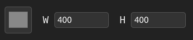
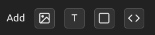
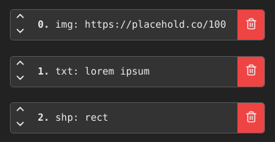
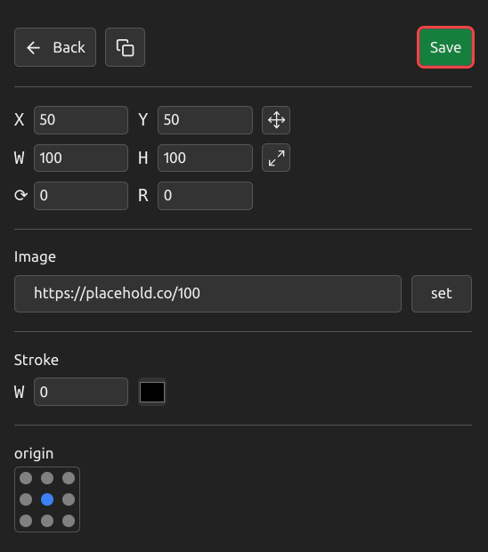
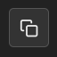

## Hi. This is the documentation for using IMGENX


### [IMGENX SITE](https://imgenx.vercel.app/)

### What is it?

This is a service that allows you to generate images dynamically based on a URL.

### How to use it?

You can either write the link yourself, for example, by generating it through code, or use the editor. IMGENX has a relatively user-friendly editor, with which you can create the image you need and get a ready-made link to it, then you can change it through the stake, for example, text, color, or something else.

### Using editor

Go to [https://imgenx.vercel.app/](https://imgenx.vercel.app/). After that, you'll see a gray canvas 400 by 400 pixels. In the sidebar, you can change this color and size.




Below you will see the "Add" panel here you will be asked to add various elements

- Picture
- Text
- Shape (so far there is only a rectangle)
- Layer code

We need to talk about the Layer Code separately, each layer is represented by a kind of pattern, it is located in your link split `|` so you can copy it from someone else's picture.



After adding, you will see the following buttons, these are layers, each layer is a separate element on the canvas. Using the arrows, you can change their order so that some do not overlap others. You can also delete them.



Each layer has its own parameters, let's look at the example of an image.

X Y W H is the X and Y position, respectively, as well as the height and width. You can also rotate the picture or make it rounded.

To change the image, add a link in the `Image` field and click `set`.

You can add a stroke, set its color and width.

`Origin` is the starting point from which the transformation will begin.

It seems to be simple)

**To quickly resize, hold down W or H and drag**



You can copy each layer, and it will appear as a Layer Code. 

It uses a special pattern. [Learn more](#pattern)



Other components have roughly similar parameters - visit the site above to test them.

### Saving project

The project does not have a database and the like, all the changes you make are saved in the URL.

And it's convenient. Because your entire project is a link. That is, you can take any picture, remove the `img` from the URL and edit it easily. You can, for example, send a project to a friend so that he can edit it or take the necessary layers from it. Or if you only have a picture, just add `img` and you are now editing it. It's very convenient. But there are also disadvantages, for example, the URL length is only 2048 characters, so you can't make a very large project and if you lose the link you will lose your project.


### Pattern

Here is the most interesting part. As you already know, all the data about the image is combined with the link. So let's take a look at


This image was generated dynamically using the IMGENX service

Let's analyze what's in it

https://imgenx.vercel.app/img?s=400x400&fill=0xffffff&l=shp:rect;x:320,y:230,w:120,h:120,c:0xff1f1f,r:0,rd:30,o:em,bw:17|shp:rect;x:130,y:150,w:120,h:120,c:0x41c84a,r:0,rd:30,o:sm,bw:17|shp:rect;x:70,y:230,w:120,h:120,c:0x2b6f91,r:0,rd:99,o:sm,bw:17|txt:1;x:199,y:143,c:0x000000,s:49,r:0,o:cm|txt:2;x:268,y:233,c:0x000000,s:49,r:0,o:cm|txt:3;x:137,y:231,c:0x000000,s:49,r:0,o:cm


At first glance, it doesn't look clear at all

```
https:// imgenx.vercel.app/ 
? 

s = 400x400 

& fill = 0xffffff

&l=
    shp: rect;   x: 320, y: 230, w: 120, h: 120, c: 0xff1f1f, r: 0, rd: 30, o: em, bw: 17 |
    
    shp: rect;   x: 130, y: 150, w: 120, h: 120, c: 0x41c84a, r: 0, rd: 30, o: sm, bw: 17 |

    shp: rect;   x:70,  y: 230, w: 120, h: 120, c: 0x2b6f91, r: 0, rd: 99, o: sm, bw: 17 |

    txt: 1;   x: 199, y: 143, c: 0x000000, s: 49, r: 0, o: cm |

    txt: 2;   x: 268, y: 233, c: 0x000000, s: 49, r: 0, o: cm |

    txt: 3;   x: 137, y: 231, c: 0x000000, s: 49, r: 0, o: cm 

```

Isn't that better?

- s is the size of the canvas, i.e. your picture
- fill is the background of the picture
- l is the layers of the picture

So far, these are all the parameters that can be used

If I think everything is clear with the sizes and fill, then let's look at the `l` parameter. As mentioned earlier, these are all the layers that are in your picture, they are separated by the symbol `|`. That is, the pattern of layers looks like this

```
type:data;params|type:data;params|...
```

There are 3 types so far:
- img - picture
- txt - text
- shp - shape (there is only a rectangle, but it can be turned into an oval or circle)

Data is information of the type, for example, if the type is a picture, then it is clear that the data should contain a link to the picture, if it is text, then there will be text accordingly

Next are the layer settings, they resemble the type of JSON, in general, everything is clear here, but it is necessary to explain for `0x` is hex, just in the URL `#` is a hash, and if you put it in the link, everything will break. Therefore, instead of `#`, `0x` is used, followed by a regular hex.

It may also be unclear with `o: cm` or `o: sm` it is the 2nd position of the anchor point at the `xy` coordinates

```
for x it is s - start, c - center, e - end   
for y it is t - top, m - middle, b - bottom
```

by adding them together you can set the position of the anchor point


### Conclusion.

That seems to be all. If you have any questions or ideas, you can send me 
[EMAIL](mailto:ghtx280@gmail.com)

If you find a bug, please report it to [ISSUES](https://github.com/ghtx280/imgen/issues)
